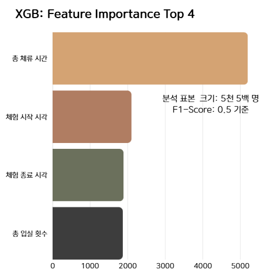
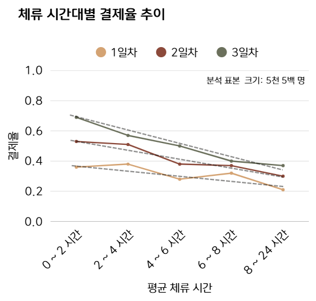
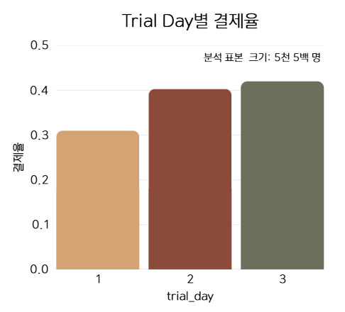
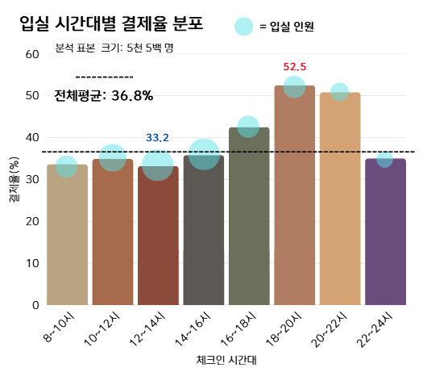
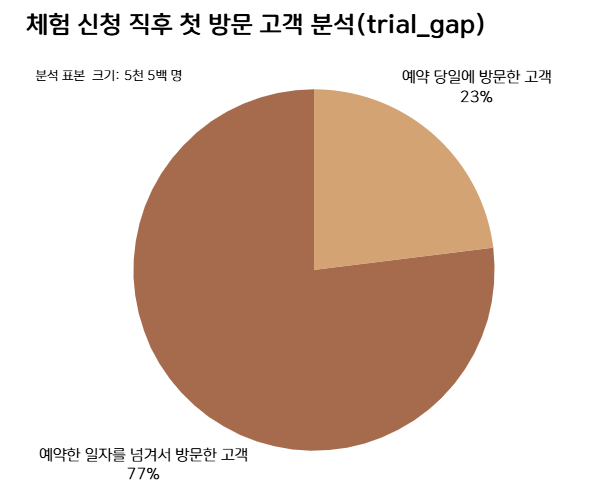
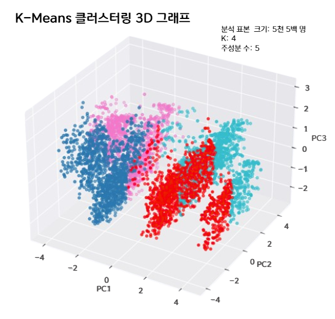
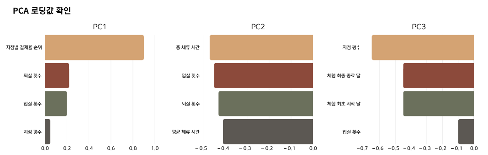

# Project - 공유 오피스 출입 데이터 분석

주제: 공유 오피스 출입 데이터 기반 결제 전환 분석  
기간: 2025.09.03 ~ 2025.09.15  
유형: Codeit 데이터 분석 프로젝트 (팀 프로젝트)  

---

### Background  

공유 오피스 서비스는 무료 체험 이후 유료 전환율이 낮은 구조적 문제를 겪고 있었고,  
체험 데이터를 어떤 기준으로 해석하고 비즈니스 전략으로 연결할지에 대한 명확한 방향이 없는 상황이었음  

본 프로젝트는 공유 오피스 출입 로그 데이터를 기반으로  
체험 이용 패턴과 결제 전환의 관계를 정량적으로 분석하고,  
내부 데이터의 한계를 보완하기 위해 외부 상권·사무직 밀집도 데이터를 결합하여  
실제 실행 가능한 수익 개선 전략 도출을 목표로 진행됨    

 

**(1) Data Collection**  

- 출입 로그 데이터: user_id, site_id, 입·퇴실 시각, 체류 시간  
- 무료 체험 이력: trial_day, 예약일, 실제 방문일, 결제 여부  
- 외부 데이터: 지점 인근 사무직 밀집도(통계지리정보서비스), 경쟁사 사례 자료  

 

**(2) Data Preprocessing**

- 유저별 최초·최종 방문일 기준 `trial_day` 산출
- 무료 체험 3일을 넘긴 이상 유저 정의 및 제거(전체의 약 2.2%)
- 결측치·중복 데이터 정합성 검증
- 유저 단위 분석 테이블 생성
- 파생 변수 생성
 - trial_gap(예약일-첫 방문일 차이)
 - 방문 횟수, 평균 체류 시간, 시간대별 이용 패턴 등

 

**(3) Analysis & Impact**

- Feature Importance 기반 전환 영향 요인 도출(XGBoost)
 
    
> XGBoost 기반 전환 예측 모델 분석 결과,  
> 전환 예측에 가장 크게 기여한 변수는 `총 체류 시간` 으로 나타남

 

- 체험 이용 패턴과 결제 전환 간의 관계 분석    

  
> 초기 가설은 '체류시간이 길수록 만족도가 높아 결제로 이어질 것이다.' 였지만,  
> 실제 데이터에서 **모든 체험 일차에서 체류 시간이 길수록 결제율이 일관되게 하락**       
> 해당 결과로 이용량 중심 가설을 폐기하고, 체험 이용 패턴 및 환경 요인 중심 분석 구조로 전환  

 

- 체험 일차별 & 입실 시간대  결제율 세그먼트 분석 진행

  

 

- 3일 무료 체험을 온전히 이용한 고객 분석
 

>연속 3일 무료 체험 구조에서,  
> 예약 당일 방문한 고객은 전체의 **23%**에 불과했으며,  
> **77%의 고객은 예약일을 넘겨 체험을 시작**한 것으로 나타남     
> 이는 체험 일차가 증가할수록 결제율이 상승하는 지표와 달리,  
> 다수의 고객이 개인 일정 등의 이유로 **무료 체험을 온전히 활용하지 못하고 있음**을 의미하며,  
> **체험 구조 개선을 통해 전환율을 추가로 끌어올릴 수 있는 기회 요인**으로 판단   

 

- PCA + K-Means 기반 고객군 세분화

> PCA를 통해 24차원 → 5차원으로 축소한 후 K-Means(K=4)로 고객군을 세분화한 결과,    
> 이용 패턴이 유사한 유저들이 4개의 뚜렷한 군집으로 분리되었으며,  
> 각 군집 간 결제율과 이용 특성이 유의미하게 달랐음    

 

> PCA 로딩값 해석 결과,
> PC1은 지점 특성 축(지점별 결제율, 입·퇴실 횟수),  
> PC2는 체험 이용 강도 축(총 체류 시간, 입·퇴실 횟수),
> PC3는 지점 규모 및 체험 시기 축(지점 평수, 체험 시작·종료 시각) 으로 해석됨  
> 이를 통해 고객 군집이 단순 행동량이 아니라 지점 특성(환경)과 이용 패턴의 조합으로 구분됨을 확인함

 

- 지점 입지(사무직 밀집도)와 결제율 관계 분석  

- `site_id`별 지점 평수 데이터 및 지점 주소 기준 가장 가까운 역 근처 사무직군 조사 (통계지리정보서비스 SGIS)

 

- `site_id`별 평수 및 결제율

| 순위 | site_id | 평수 | 결제율(%) |
|------|---------|------|-----------|
| 1위  | 5       | 150  | **45.01** |
| 2위  | 1       | 50   | 39.31     |
| 3위  | 4       | 100  | 38.99     |
| 4위  | 3       | 150  | 38.62     |
| 5위  | 17      | 50   | 34.20     |
| 6위  | 6       | 150  | 34.01     |
| 7위  | 2       | 100  | 33.15     |

> 상위 지점  
> `site_5`: 타 지점 대비 주변 역 사무직군 수 9배 높음  
> `site_1`: 타 지점 대비 주변 역 사무직군 수 13배 높음  
> `site_4`: 타 지점 대비 주변 역 사무직군 수 43배 높음

> 하위 지점  
> `site_6`: 타 지점 대비 주변 역 사무직군 수 29배 적음  
> `site_2`: 타 지점 대비 주변 역 사무직군 수 2배 많음  

> 결제율 상위 지점들은 공통적으로  
> **주변 역 사무직 수요가 매우 높은 입지**에 위치해 있었으며,    
> 입지 수요가 낮은 지점일수록 결제율이 낮은 경향이 확인  

 

- 각 클러스터 결제율 대입 해석 결과

| 고객군 | 결제율(%) | 지역 특성 | 체류 특성 | 비즈니스 해석 |
|------|-----------|-----------|-----------|--------------|
| 파랑 | 31.64 | 비사무 밀집 지역 | 체류 시간 김 | 가격 부담·니즈 불일치 가능성 |
| 빨강 | 38.51 | 사무직 밀집 지역 | 체류 시간 김 | 혜택·가격 설계 개선 시 전환 여지 |
| 분홍 | 35.33 | 비사무 밀집 지역 | 체류 시간 짧음 | 온보딩·초기 경험 개선 타깃 |
| **민트** | **42.30** | **사무직 밀집 지역** | **체류 시간 짧음** | **최우선 핵심 전환 타깃** |

 

**주요 인사이트**

- 체험 일차 증가 → 결제 확률 상승
- 체류 시간은 결제율과 음의 상관관계
- 18시 ~ 20시 입실 고객 결제율 최고
- 단기 체류 + 사무직 밀집 지역 지점 고객군 → 최고 결제율
- 비사무 밀집 지역 + 장기 체류 고객군 → 최저 결제율
- 체험 3일 모두 이용 고객: 23%
- 예약일 이후 방문 고객: 77%
- 체험 1일 이용 후 이탈 고객 다수 존재

 

**전략 도출**

- 시간대 특화 할인 회원권 상품 설계
- 체험 1일차 고객 대상 온보딩·가이드 강화
- 사무직 밀집 지역 중심 지점 확장 전략
- 무료 체험 일정 관리 시스템 및 리마인드 메시지 개선

 

**(4) Challenge & Learning**

**Challenge**
- 전처리 기준 부재로 동일 조건에서도 분석 결과가 달라지며 초기 신뢰도 하락
- 단순 이용량 가설이 반복적으로 붕괴되며 분석 방향 재정립 필요

**Action**
- 팀원들과 전처리 기준 재정의 (이상 유저, trial_day, 결측·중복 규칙 통일)
- 이용량 중심 분석 → 이용 패턴 중심 구조로 전환
- 지점 상권·사무직 밀집도 외부 데이터 결합

**Learning**
- 전처리 설계가 분석 성과와 신뢰도를 결정함을 체감
- 전환 핵심 요인이 이용량이 아닌 이용 패턴과 입지임을 검증
- 외부 데이터 결합이 인사이트 해석력을 크게 강화함

 

**(5) Report**

- 분석 결과를 문제 → 인사이트 → 전략 → 기대 효과 구조로 재구성하여 보고서 설계
- 결제 전환에 영향을 미치는 핵심 요인을 중심으로
  의사결정에 바로 활용 가능한 스토리라인으로 정리
- 지점 전략·회원권 기획·체험 개선 방안을
  정량 근거 기반으로 제시하여 팀 내 공유 및 발표 진행

 

**(6) Review**

- 데이터 기반 의사결정의 실제 비즈니스 적용 흐름을 경험
- 분석 구조화·전처리·커뮤니케이션의 중요성 명확히 인식
- 향후 A/B 테스트 및 전환 정책 실험으로 확장 필요성 인지
- 본 프로젝트를 통해 데이터 분석가로서 문제 정의부터 전략 제안까지의 전체 사이클을 처음으로 완주함
