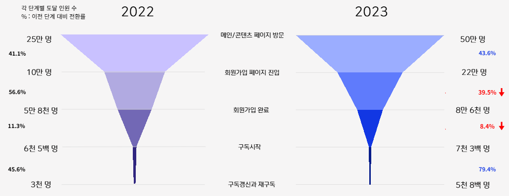
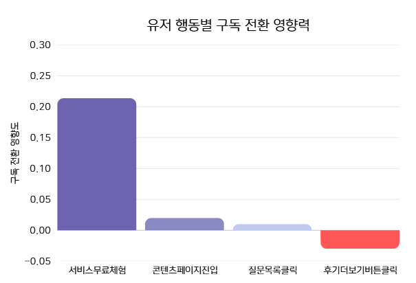
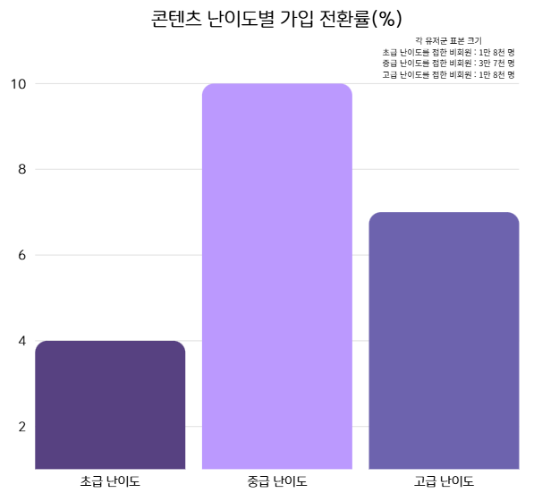
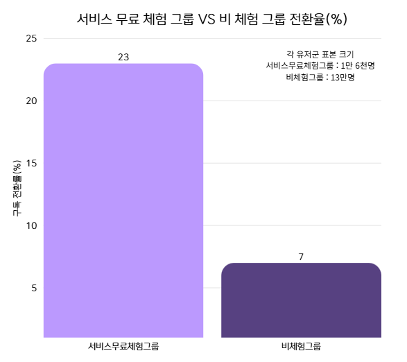
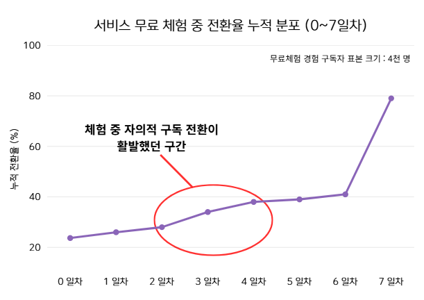
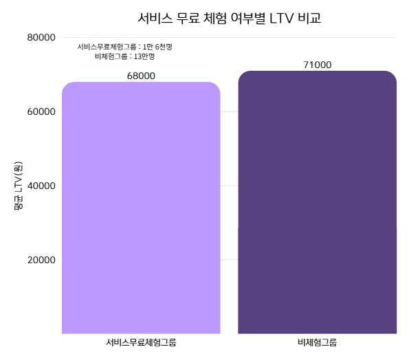

## Project - 온라인 교육 서비스 구독 전환 분석

- 주제 : 온라인 교육 서비스 구독 전환율 및 수익성 개선
- 기간 : 2025.07.04 ~ 2025.07.30
- 유형 : Codeit 데이터 분석 프로젝트 (팀 프로젝트)

---

### Background

온라인 교육 서비스 A사는  
회원가입 → 구독 과정에서 높은 이탈률과 낮은 전환률 문제를 겪고 있었음  
본 프로젝트는 **유저 생애주기** 관점에서  
유입부터 이탈까지의 전 과정을 분석하여  
**구독 전환율과 수익성 개선을 위한 데이터 기반 전략을 도출**하는 것을 목표로 진행됨

 

**(1) Data Collection**

- 서비스 로그 데이터 (페이지 진입, 회원가입, 결제, 구독 취소 등)
- 무료 체험 및 구독 이력 데이터
- 콘텐츠 정보 데이터 (난이도, 유형, 신규/기존 여부)
- 비회원 데이터는 고유 ID 부재로 **디바이스·환경 기반 fingerprint 생성**하여 식별 처리

 

**(2) Data Preprocessing**

- 이벤트 로그 정합성 검증 및 중복 제거
- 콘텐츠 유형(신규/기존), 난이도 파생 변수 생성
- 이상치 탐지: **구독 종료 버튼 클릭 시간이 결제 완료 시간보다 빠른 이상 행동 유저** 검출

 

**(3) Analysis & Impact**  

- Funnel 분석: 유입 → 전환 → 이탈

  

- 신규/기존 콘텐츠 세그먼트 비교를 통해 **신규 콘텐츠의 전환 기여도 확인**  
- 카이제곱 검정, Z-test 전환율 차이 통계 검증

- 회귀 분석을 통한 전환 영향 요인 도출

  

- LTR/LTV 분석을 통해 **무료 체험 정책의 수익성 구조 평가**
 
- 무료 체험 시기별 레슨 소비량 분석  
  - 무료 체험 시기 유저당 평균 레슨 수: 80건  
  - 무료 체험 폐지 시기 평균 레슨 수: 49건  
    → 무료 체험이 **콘텐츠 몰입도와 초기 활성도에 강한 영향을 미침을 확인**   
  
- 위 분석을 바탕으로 다음 전략을 도출  
  - **무료 체험 기간 단축 및 재설계**
  - **신규·중급·실습형 콘텐츠 메인 노출 강화**
  - **체험 종료 4 ~ 6일차 리마인드 메시지 집중 운영**  

 

**(4) Challenge & Learning**
- 본 데이터에는 **무료 체험 정책이 중간에 폐지된 시점이 존재**한다는 특징이 있어,   
  단순 전·후 비교만으로는 정책 효과를 해석하기 어려운 구조적 한계가 존재했음
  
- 무료 체험이 실제로 전환에 기여했는지를 판단하기 위해,  
  무료 체험 유저와 비체험 유저를 분리하여 구독 전환 패턴을 재설계하여 분석함
  
- 무료 체험 기간 동안의 전환 흐름을 1 ~ 7일차로 세분화한 결과,  
  2 ~ 4일차 구간에서 뚜렷한 구독 전환 상승 패턴을 발견함
  
- 또한 무료 체험 유저의 구독 전환율이 **비체험 유저 대비 3배 높게 나타나**,   
  정책 폐지보다는 **개편을 통한 재도입이 더 합리적인 선택**일 수 있음을 도출함
  
- 이를 통해, 단순 지표 비교가 아니라  
  **정책의 맥락과 데이터 구조를 함께 이해해야 올바른 인사이트를 도출할 수 있다는 점**을 학습함

 

**(5) Report**

- 신규 콘텐츠를 접한 비회원의 회원가입 전환률이 기존 콘텐츠 대비 유의미하게 높음

  

- 중급 난이도·실습형 콘텐츠 이용 유저의 가입 전환률이 가장 높게 나타남

  

- 무료 체험 유저의 구독 전환률이 비체험 유저 대비 3배 이상 높음

  

- 전환이 집중되는 핵심 구간: 체험 2 ~ 4일차 / 체험 종료 후 4 ~ 6일차  
  (7일차: 자동 결제 영향일 가능성이 높으므로 분석에서 제외)  

  
  

- 무료 체험 유저의 LTR은 증가, 그러나 CPA를 고려한 LTV는 오히려 감소

  

- 후기 더보기 버튼 클릭 유저의 구독 전환률이 오히려 낮은 경향 확인

 

**(6) Review**

- 전환률만으로 전략을 판단하면 오판을 할 가능성이 있다고 느꼈음
- 향후 A/B 테스트 기반 무료 체험 기간 최적화 필요
- 메시지·콘텐츠 추천 전략의 추가 검증 필요
