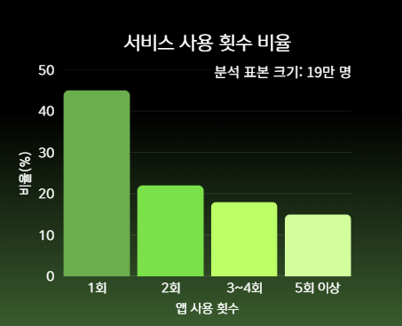
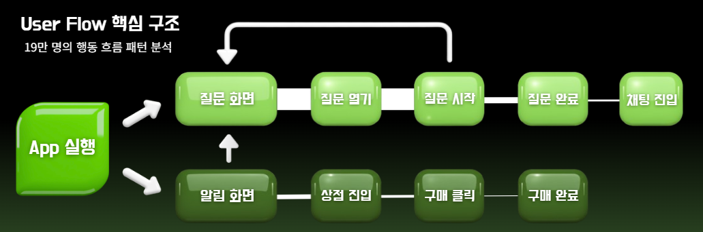
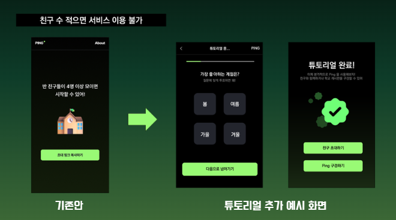
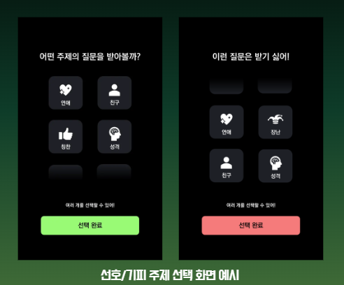
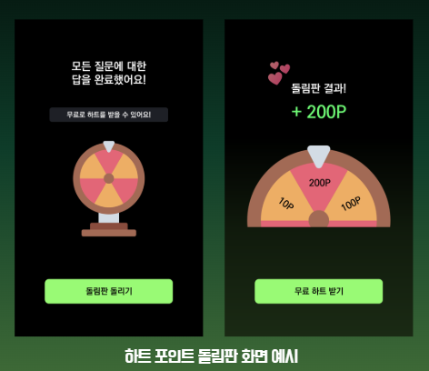
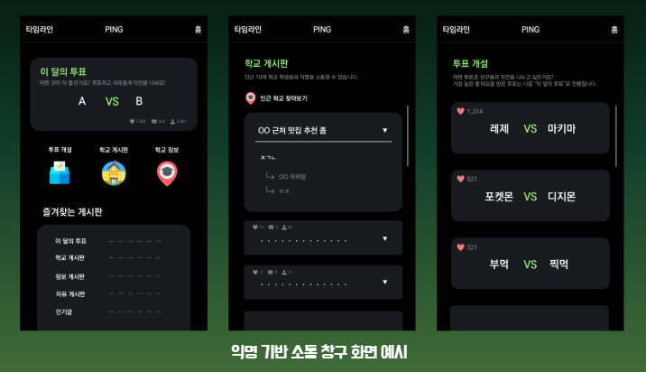
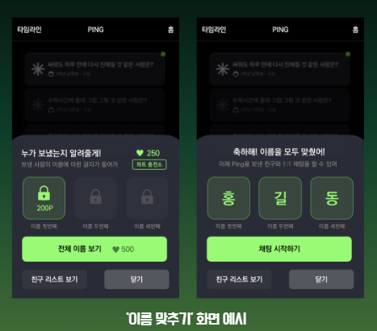

# 익명 투표 SNS 행동 데이터 분석

주제: 익명 투표 SNS 행동 데이터 분석 및 개선점 도출  
프로젝트 기간: 25.10.10 ~ 25.11.14  
유형: Codeit 데이터 분석 프로젝트 (팀 프로젝트)  

---

### Background

본 서비스는 익명 기반 투표·질문·소통 기능을 제공하는 SNS 플랫폼으로,  
출시 이후 유입 대비 재방문율과 결제 전환율이 매우 낮은 구조적 문제를 겪고 있었음  

초기 분석 결과,  

- 전체 유저의 60% 이상이 1회 사용 후 이탈
- 결제 및 커뮤니티 기능의 이용률 저조
- 유저의 주요 활동이 '투표 주제 탐색'에 머물며 핵심 기능(투표 완료·소통)까지 도달하지 못하는 구조

라는 문제를 확인하였고,  
이를 해결하기 위해 유저 행동 흐름(User Flow)을 중심으로 서비스 구조를 정밀 분석하고  
실제 실행 가능한 UX·비즈니스 개선안 도출을 목표로 프로젝트를 진행함  

<br>

**(1) Data Collection**

| 구분        | 내용                          |
| --------- | --------------------------- |
| 유저 행동 로그  | 약 19만 명, 1,100만 건 이상 이벤트 로그 |
| 유저 정보     | 성별, 학교, 학년, 알림 설정 등         |
| 투표·질문 데이터 | 질문 주제, 작성·응답·선택 기록          |
| 결제 데이터    | 하트 상품 구매 이력                 |
| 신고 데이터    | 신고 횟수 및 사유                  |

<br>

**(2) Data Preprocessing**
- 초기 데이터 구조에서 `user_id`, `device_id`, `session_id` 관계가
  뒤섞여 행동 흐름 분석이 불가능한 상태였기 때문에,
- 데이터 구조 제설계부터 직접 수행함

① 유저–디바이스–세션 구조 재설계  
- 문자·공란·NULL user_id 제거  
- 다중 기기 사용자 제거  
- 다중 사용자 공유 기기 제거  
(user_id, device_id, session_id) 완전 중복 제거  
  → 최종 228,205명의 유저에 대해 1:1:1 구조 확립  
  
② Event Flow 구축  
- 세션 내 이벤트 시간순 정렬  
- 동일 이벤트 연속 발생 압축  
- 90분 이상 간격 시 세션 재분리  
  (다음 로그 발생까지 90분 이상 차이 발생 시 앱 종료 후 시작으로 간주)    
- 유저별 event_flow 생성    
  → 정제된 행동 로그 기반 분석 환경 완성  

<br>

**(3) Analysis & Impact**
  
- 단발성 이용 구조
  - 전체 유저의 약 45%가 1회 이용 후 이탈
  - 5회 이상 이용 유저 15%

  

<br>

- 행동 패턴 분석 (PrefixSpan)
  - 3-Step 패턴 기준 핵심 인사이트
    - 탐색 중심 행동이 지배적
    - 질문 완료 퍼널 급감
    - 결제·커뮤니티 전환은 구조적 한계

- User Flow 핵심 구조

  

```bash
  앱 실행  
   → 투표 주제 탐색 반복  
     → 투표 시작 진입  
       → 투표 완료 (급감)  
         → 투표자와의 채팅 or 아이템 결제 전환 (극소수)
```

<br>
  
- 결제 구조 문제
  - 상점 접근률·구매 전환율 매우 낮음
  - 결제 아이템의 구매 가치 인식 부족 (하트 아이템의 소모처 부족 등)
  
<br>

**(4) Challenge & Learning**

**대용량 로그 처리 및 성능 최적화**

- 1100만 건 이상의 대용량 로그 처리로 인해 성능 개선이 필요한 상황
  - `hackle_events(session_id)`  
  - `hackle_events(event_datetime)`,    
  -`hackle_events(session_id, event_datetime)`  
    → 복합 인덱스를 생성하여    
      세션 단위 이벤트 정렬 및 event_flow 생성 쿼리의 처리 속도를 개선
    
- 유저 식별자 정제 및 매핑 검증이 필요한 상황  
  - `hackle_properties(device_id, user_id)`  
     → 복합 인덱스를 적용하여    
       대규모 데이터에서 device–user 1:1 매핑 검증 및 중복 제거 쿼리 성능을 안정화함

```sql
-- hackle_properties 인덱스 설계

-- JOIN 성능 개선 (session_id)
CREATE INDEX idx_hackle_properties_session_id
    ON final.hackle_properties (session_id);

-- device_id 중복 검출 & 그룹화 최적화
CREATE INDEX idx_hackle_properties_device_id
    ON final.hackle_properties (device_id);

-- user_id 정제 & 중복 판별
CREATE INDEX idx_hackle_properties_user_id
    ON final.hackle_properties (user_id);

-- 핵심: device-user 1:1 매핑 검증용 복합 인덱스
CREATE INDEX idx_hackle_properties_device_user
    ON final.hackle_properties (device_id, user_id);
```

<br>

**행동 패턴 마이닝 (PrefixSpan)**

- 데이터 정제 후 패턴 분석이 필요한 상황
- PrefixSpan을 사용하여 시간순으로 정리된 `event_flow` 내 패턴 분석
- 유저가 가장 많이 밀집되는 구간과 이탈이 급증하는 지점을 정량적으로 식별

```python
from prefixspan import PrefixSpan

# event_flow를 시퀀스 형태로 변환
sequences = flow_pattern_search_df['event_flow'] \
    .dropna() \
    .apply(lambda x: x.split(',')) \
    .tolist()

# PrefixSpan 적용
ps = PrefixSpan(sequences)
ps.maxlen = 3              # 최대 3-step 패턴까지 분석
min_support = 1000        # 최소 지지도 기준

patterns = ps.frequent(min_support)

# 지지도 기준 정렬 및 의미 없는 패턴 제거
patterns = sorted(patterns, key=lambda x: x[0], reverse=True)
patterns = [
    (support, seq) for support, seq in patterns
    if len(seq) >= 2 and len(set(seq)) > 1   # A→A 같은 반복 패턴 제거
]
```

<br>

**구조적 취약점 발견 및 서비스 개선 설계**

- 친구 4명 이상이 없으면 핵심 콘텐츠 이용이 불가능한 구조적 취약점 발견    
- 패턴 분석 결과, 투표 완료 후 신규 기능 ‘채팅방’ 이용 유저들의 유지 패턴 확인  
  
- 이를 바탕으로  
  - 인근 학교 기반 소통 공간 기능 제안    
  - 신규 유저도 해당 공간을 통해 서비스 적응 및 친구 관계 형성 가능하도록 설계  
 
    

<br>

**Learning**

- 분석 이전에 데이터 구조 설계가 핵심임을 체득
- 단순 지표보다 행동 흐름 기반 문제 정의의 중요성을 학습

<br>

**(5) Report**

**서비스 개선 제안**

- 투표 주제 탐색 반복 구간 해소
  - 선호/기피 주제 선택 UX
  - 개인화 추천 질문 제공

    

<br>

- 질문 완료율 개선
  - 질문 완료 보상 시스템(하트 포인트 등)

   

<br>

- 커뮤니티·소셜 기능 강화
  - 인근 학교 기반 소통 공간 개설

   

<br>

- 결제 구조 개선
 - 아이템 다양화 및 사용처 확대를 통한 구매 가치 상승
 - 기존 초성 맟추기 시스템 → 이름 맟추기 시스템으로 변경
 - 초성 힌트와 관계없이 무료 입력 기회 3회 제공
 - 이후 추가 입력 시 하트 소모
 - 이름 정답 시 해당 질문에 대한 채팅방 개설 무료화  

   

<br>

**(6) Review**

이 프로젝트를 통해  
행동 로그 분석 → 문제 구조화 → UX·비즈니스 개선 까지지의 과정을 경험함  
특히 데이터 구조 재설계부터 시작한 점은  
단순 분석을 넘어 서비스 성장 문제를 해결하는 분석가의 역할을 깊이 이해하게 된 계기가 되었음    
